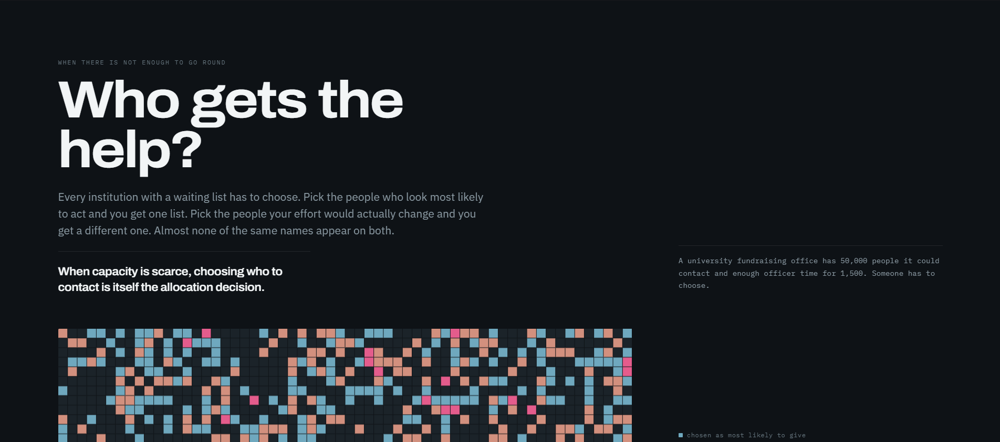
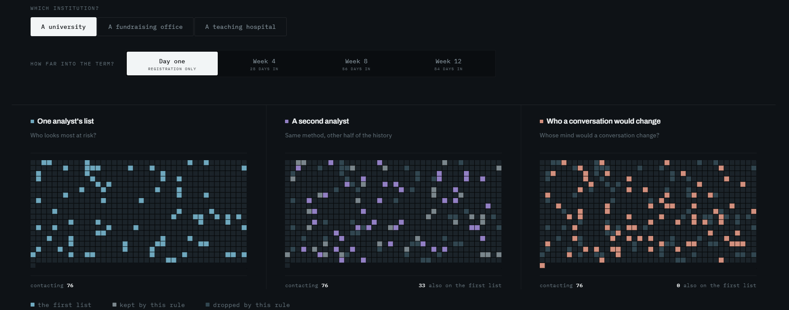
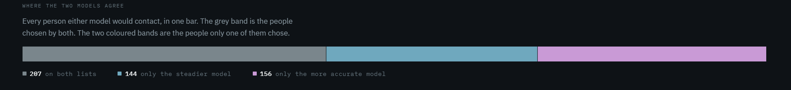
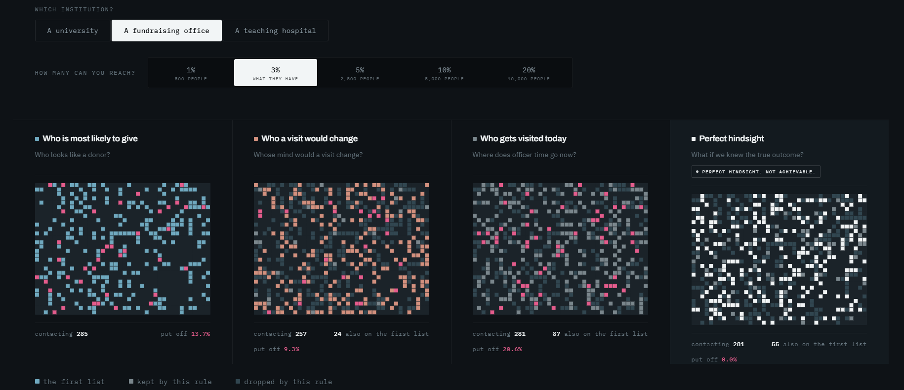

<div align="center">

# Marginal

### An interactive research piece on allocation under constraint

**When capacity is scarce, choosing who to contact is itself the allocation decision.**

[](https://marginal-site.vercel.app)
[](https://research.stem.open.ac.uk/ouanalyse/dataset/)
[](https://physionet.org/content/mimiciv/)
[](https://scikit-learn.org)
[](#technologies-used)
[](#license)

<br/>



<br/>

### [▶ Open the interactive piece](https://marginal-site.vercel.app)

</div>

---

## At a glance

> A 20 second read of the entire project.

- 🎯 **Problem.** Universities, hospitals and fundraising offices all have more people than help to go round. The usual answer is to rank people by who looks most likely to act. That is not the same as ranking them by who the help would change.
- 🧪 **Approach.** One question asked in three institutions: real student records (OULAD), real hospital admissions (MIMIC-IV v3.1), and an invented fundraising population of 50,000 in which the true effect of a visit is known for every person.
- 📉 **Key insight.** A better prediction is not a better allocation. A sharper model did not make two analysts agree. The more accurate hospital model was the less repeatable one. And in fundraising, choosing on likelihood to give caused 113 extra gifts where choosing on effect caused 156.
- ⚙️ **Stack.** Python, pandas and scikit-learn for the analysis. Static HTML, CSS and JavaScript with canvas for the site: no framework, no build step.
- 🌐 **Live demo.** [marginal-site.vercel.app](https://marginal-site.vercel.app)

---

## Project highlights

✔ Three institutions, one question, one visual grammar<br/>
✔ University: Open University Learning Analytics Dataset, 32,593 registrations and 10,655,280 clickstream rows<br/>
✔ Hospital: MIMIC-IV v3.1, 321,547 admissions, 64,093 held out for scoring<br/>
✔ Fundraising: an invented population of 50,000 with both outcomes known for every person<br/>
✔ Logistic regression against gradient boosting, each rebuilt 8 times on resampled training data<br/>
✔ Capacity as a live control, from 1% to 20% of the population<br/>
✔ Every person drawn as a mark, every field read against the same reference list<br/>
✔ Assumed quantities, effect size and harm prevalence, swept across ranges rather than asserted<br/>
✔ Sources register with dataset versions and SHA256 hashes<br/>
✔ No number typed by hand: the site reads one file written by the pipeline<br/>
✔ Per-patient fields removed at source before publication

---

## Table of contents

1. [Interactive demo](#interactive-demo)
2. [Key findings](#key-findings)
3. [Overview](#overview)
4. [Why this problem matters](#why-this-problem-matters)
5. [Research question](#research-question)
6. [Methodology](#methodology)
7. [Architecture](#architecture)
8. [Data, privacy and sources](#data-privacy-and-sources)
9. [Technologies used](#technologies-used)
10. [Repository structure](#repository-structure)
11. [Installation](#installation)
12. [Running locally](#running-locally)
13. [Future work](#future-work)
14. [Acknowledgements](#acknowledgements)
15. [License](#license)

---

## Interactive demo

**[https://marginal-site.vercel.app](https://marginal-site.vercel.app)**

The live piece is the fastest way to understand the result. Open it and try it yourself:

- **Start with the university and step from Day one to Week 12.** The model's accuracy climbs. The two analysts' lists do not move closer together.
- **Switch to the fundraising office and move capacity from 1% to 20%.** At 1% the two rules share almost nobody. Watch how slowly they converge as the room grows.
- **Open the teaching hospital and press Rebuild both models.** Same data, resampled. See which model's list comes back.
- **Read the grey.** In every field after the first, grey marks are people a rule kept from the first list, and coloured marks are people it reached instead.

Nothing is calculated in your browser. The page reads aggregated results produced by the analysis, which keeps it fast and keeps every number traceable to the step that made it.

---

## Key findings

All numbers below come from the analysis pipeline and appear on the live site.

> **A better prediction is not a better allocation. Under a fixed capacity, accuracy, agreement and impact are three different things, and optimising the first does not deliver the other two.**

**Two analysts, same method, different lists.** In a university course, two analysts trained the same model on different halves of the student record. With room to contact 10% of students, each contacts 76, and 33 appear on both lists: an overlap of **27.7%** on day one. Over twelve weeks the model's AUC rises from **0.596 to 0.714** in that course, while the overlap stays between **26.0% and 29.7%**. Across all courses, tested on courses the model had not seen, the gain from waiting was within run-to-run noise.



**The more accurate model is the less repeatable one.** In a teaching hospital, a gradient boosted model beats logistic regression on AUC, **0.682 against 0.654**, for 30-day readmission. Rebuilt eight times on resampled training data at a 5% enrolment capacity, the boosted model keeps a median **65.2%** of its list between rebuilds; the logistic model keeps **90.0%**. The total each would report moves by **0.5%** and **0.1%**, so no standard report would reveal the difference.



**Here the right answer is known, and every workable method misses most of it.** In an invented fundraising population of 50,000, what each person would do with and without a visit is known by construction. With visits for 3% of them:

| Approach | Extra gifts caused |
| --- | ---: |
| Choose who a visit would change | **+156** |
| Choose who is most likely to give | +113 |
| Current practice | +41 |
| Perfect hindsight, not achievable | +506 |

The fields a fundraising database records explain **4.7%** of the variation in who benefits. The limit is the information, not the model.



> **What would change the conclusion.** The advantage of choosing on effect rather than on likelihood comes almost entirely from avoiding people the contact would put off. Where that group is absent, the two approaches are close and the simpler one wins. That is the question to answer before switching.

---

## Overview

Every institution with a waiting list has to choose. An advising office can only call so many students. A follow-up care programme has a fixed number of places. A gift officer has a fixed number of visits in a year.

The common answer is to rank people by predicted risk or likelihood and work down the list. Marginal asks what that ranking actually decides. Rank people by who looks most likely to act and you get one list. Rank them by who the help would change and you get a different one, often with almost nobody in common.

The project asks that question in three institutions and builds the answer as an interactive piece rather than a report. Each person is a mark. Each rule paints the marks it would choose. Change the capacity, the point in the term, or the training sample, and watch who moves.

> ### Featured finding
>
> **Under a fixed capacity, the more accurate model was the less repeatable one, and a sharper model did not make two analysts agree on who to help.**
>
> Everything else in the repository exists to establish that rigorously and let you check it yourself.

---

## Why this problem matters

In all three settings, the default is to target by predicted risk. Early alert systems flag the students most likely to withdraw. Readmission programmes enrol the patients most likely to return. Prospect research scores the donors most likely to give.

But help only matters where it changes the outcome. A student who would withdraw regardless, or a donor who would give anyway, uses a scarce place without anything changing. And in some settings contact can make things worse: a solicitation can put off someone who would otherwise have given.

Prediction accuracy is the number that gets reported, so it is the number that gets optimised. Marginal shows three ways that number can mislead: two equally valid analyses disagreeing about who to help, a more accurate model producing a list that cannot be reproduced, and a likely-to-give ranking spending visits on people the visit does not move.

---

## Research question

> **When capacity is fixed, does ranking people by risk select the same people as ranking them by how much the help would change their outcome, and how stable is either list?**

| Institution | Data | The help on offer | Outcome | What varies on the site |
| --- | --- | --- | --- | --- |
| University | OULAD, real records | An advisor reaching out | Withdrawal | Point in the term, day one to week 12 |
| Teaching hospital | MIMIC-IV v3.1, real records | A place in a follow-up care programme | Readmission within 30 days | Capacity, and rebuilding both models |
| Fundraising office | Invented, 50,000 people | A visit from a gift officer | A gift | Capacity, 1% to 20% |

---

## Methodology

**University.** 29,914 registrations after exclusions. A risk model is fitted at four decision points: registration, and 28, 56 and 84 days into the term. The two analysts run the same pipeline on different halves of the student record. Overlap is the share of students on either list who are on both. No experiment exists for this population, so who a conversation would change is assumed, and the assumption is swept across a range.

**Hospital.** 321,547 admissions scored at discharge for readmission within 30 days, with 64,093 held out. Logistic regression and gradient boosting are each rebuilt eight times on resampled training data. For each capacity the pipeline reports the median overlap between rebuilds, the number of distinct patients named across rebuilds per place available, and how much the total a programme would report moves. Who benefits is assumed, not measured, and the hospital chapter makes no claim about it.

**Fundraising.** A generator creates 50,000 people with both outcomes known: what each would give with a visit and without one. Current practice is confounded on purpose, because officers visit people who were already likely to give; comparing visited against not visited overstates the value of a visit by about 372%. Each approach is graded on the gifts it actually caused. Effect size and the share of people a visit puts off are swept rather than asserted, because no published estimate identifies the effect of one visit on one person.

---

## Architecture

Two layers that communicate through one file: an offline Python pipeline that is the source of truth, and a static site that only reads.

```
  Data                       Pipeline (Python)                   Reports
  ────                       ─────────────────                   ───────
  OULAD            ──►       01 to 10    university      ──►     docs/
  MIMIC-IV v3.1    ──►       11 to 17c   hospital                one report per step
  generator (18)   ──►       18 to 22    fundraising
                                   │
                                   ▼
                       23_export_site_data.py
                       checks every value, records gaps
                                   │
                                   ▼
                       site/data/marginal.json
                       aggregates and anonymous selection masks
                                   │
                                   ▼
  Site  ◄──────────────────────────┘
  ────
  index.html, styles/marginal.css
  js/content.js   plain language copy, no numbers
  js/viz.js       canvas fields and the movement ribbon
  js/app.js       state, controls and rendering
```

### Design decisions

- **Why a field of marks instead of a chart.** The finding is about which people, not how many. A bar of overlap percentages hides exactly what matters. A mark per person, held in the same place in every panel, makes disagreement visible at a glance.
- **Why one exported file.** The site cannot show a number the pipeline did not produce. The export checks every value, records missing ones as gaps, and never substitutes a plausible value. The page leaves a gap empty rather than filling it.
- **Why an invented population.** It is the only setting where both outcomes are known, so it is the only place each approach can be graded against the truth. It is labelled as invented everywhere it appears.
- **Why sweep rather than assert.** Where no published estimate exists, the conclusion is reported across the whole plausible range, so a reader can see how much it depends on the assumption.
- **Why two estimators in the hospital.** To separate accuracy from repeatability. Standard evaluation measures the first and never asks about the second.
- **Why no framework.** Static files, canvas for thousands of animated marks, and nothing to build or maintain. The site deploys as plain files and loads one data file.

---

## Data, privacy and sources

This repository contains no data.

**OULAD.** Public, licensed CC BY 4.0. Download from <https://research.stem.open.ac.uk/ouanalyse/dataset/> and extract the seven CSV files into `data/raw/`.

**MIMIC-IV v3.1.** Credentialed access only, through [PhysioNet](https://physionet.org/content/mimiciv/): complete the required training and sign the data use agreement. From the `hosp` module, download `admissions`, `diagnoses_icd`, `patients` and `services` as `.csv.gz` into `data/raw/mimic/`. This data must never be committed or shared.

**Fundraising population.** Generated by `18_advancement_generator.py`. No external data.

> **What the site publishes.** Aggregate results, plus, for a random sample of 1,200 held-out hospital admissions, which model selected each one. No identifiers, no clinical values, no outcomes. Fields the page never displayed were removed from the export at source before publication.

> **Sources register.** [`docs/08_sources.md`](docs/08_sources.md) records every dataset version, file hash and citation, and marks anything unverified as open. Nothing marked open is quoted on the site.

---

## Technologies used

| Layer | Technology | Role |
| --- | --- | --- |
| Analysis | **Python 3.13** | The numbered pipeline |
| Analysis | **pandas, NumPy, SciPy** | Cohorts, features and aggregation |
| Analysis | **scikit-learn** | Logistic regression and gradient boosting |
| Analysis | **pyarrow** | Parquet intermediates |
| Frontend | **HTML, CSS, JavaScript modules** | The site, with no framework and no build step |
| Frontend | **Canvas 2D** | Fields of marks with animated transitions |
| Hosting | **Vercel** | Continuous deployment from the `site/` folder |

---

## Repository structure

```
marginal/
├── 01_data_profile.py ... 10_distribution.py     # university
│   ├── 02_cohort.py                              # analysis population
│   ├── 04_risk_model.py                          # withdrawal risk model
│   ├── 06_allocation.py, 06b_education_roster.py # lists, and the two-analyst roster
│   └── 07_stability.py                           # stability of the ranked lists
├── 11_mimic_profile.py ... 17c_mimic_roster.py   # hospital
│   ├── 12_mimic_cohort.py                        # admissions and readmission window
│   ├── 14_mimic_risk_model.py                    # logistic and boosted models
│   ├── 15_mimic_stability.py, 16_*               # stability and validation checks
│   └── 17c_mimic_roster.py                       # rebuilds behind the site
├── 18_advancement_generator.py ... 22_*          # fundraising
│   ├── 19b_advancement_effect_recovery.py        # how much of the effect is recoverable
│   └── 22_advancement_sensitivity.py             # effect size and harm sweeps
├── 23_export_site_data.py                        # builds site/data/marginal.json
├── marginal_engine.py                            # shared by the fundraising scripts
├── docs/
│   ├── 08_sources.md                             # sources register
│   ├── images/                                   # README figures
│   └── *.md                                      # one report per pipeline step
├── site/                                         # the live site, deployed by Vercel
│   ├── index.html
│   ├── styles/marginal.css
│   ├── js/app.js, js/viz.js, js/content.js
│   └── data/marginal.json                        # the only data the site reads
├── requirements.txt
├── LICENSE
└── README.md
```

---

## Installation

Clone the repository:

```bash
git clone https://github.com/sivakumar-reddy/marginal.git
cd marginal
```

Set up Python 3.13:

```bash
python -m venv venv
# Windows:        venv\Scripts\activate
# macOS or Linux: source venv/bin/activate

pip install -r requirements.txt
```

The site itself needs nothing installed.

---

## Running locally

**View the site** using the committed results:

```bash
python -m http.server 8000 --directory site
```

Then open `http://localhost:8000`.

**Rebuild the results** (optional; requires the data described above). Run the numbered scripts in order. A lettered script follows its number: `06`, then `06b`; `17`, `17b`, then `17c`. Each writes its report to `docs/` and its intermediate results to `cache/` or `data/processed/`, both excluded from the repository. `23_export_site_data.py` writes the file the site reads.

---

## Future work

- Ground the effect side in an experiment. A randomised trial with participant-level data would replace the assumed effect in the university and hospital; a bounded search of public archives found none available.
- Show every hospital configuration interactively, not the one chosen for the site.
- Add uncertainty bands to every overlap figure.
- Test how far the findings travel, across more course presentations and a second hospital.
- Calibrate the fundraising population against a real portfolio, with an institution's cooperation.
- Make any view shareable as a link: an institution, a capacity, a point in the term.

---

## Acknowledgements

- **The Open University**, for the Open University Learning Analytics Dataset. Kuzilek J., Hlosta M., Zdrahal Z. Open University Learning Analytics dataset. Sci. Data 4:170171 (2017). <https://doi.org/10.1038/sdata.2017.171>
- **MIMIC-IV** and **PhysioNet**, from the MIT Laboratory for Computational Physiology. Johnson, A., Bulgarelli, L., Pollard, T., Gow, B., Moody, B., Horng, S., Celi, L. A., & Mark, R. (2024). MIMIC-IV (version 3.1). PhysioNet. <https://doi.org/10.13026/kpb9-mt58>. Johnson, A.E.W., Bulgarelli, L., Shen, L. et al. MIMIC-IV, a freely accessible electronic health record dataset. Sci Data 10, 1 (2023). <https://doi.org/10.1038/s41597-022-01899-x>
- **PhysioNet.** Pollard, T., Moody, B. E., Lehman, L., Gow, B., Fernandes, C., Xie, C., Johnson, A., Mark, R. G., & Heldt, T. (2026). PhysioNet as a global platform for biomedical research. Nature Health. <https://doi.org/10.1038/s44360-026-00096-z>
- **scikit-learn**, **pandas** and **Vercel**, for the analysis libraries and hosting.

---

## License

The source code in this repository is released under the MIT License. See the [`LICENSE`](LICENSE) file for details.

The data is not included and is governed separately. OULAD is licensed CC BY 4.0. MIMIC-IV is governed by the PhysioNet Credentialed Health Data License and its data use agreement, and access requires independent credentialing through PhysioNet.

---

<div align="center">

### [▶ Open the interactive piece](https://marginal-site.vercel.app)

Built by [Sivakumar Reddy Yenna](https://www.linkedin.com/in/sivakumar-reddy-yenna)

</div>
